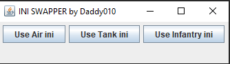

# Planetside2IniChanger
This tool will help you swap between 3 Useroption files.

The tool creates a new folder in your Planetside 2 Directory with the name "inis" (C:\Users\Public\Daybreak Game Company\Installed Games\PlanetSide 2\\inis). There you have to create 3 ini files with the names "air.ini", "tank.ini" and "infantry.ini". Then you can use my tool. The tool will copy the ini out of the inis folder and it will replace the current UserOptions.ini.

!!! Please create a backup of your current prefered UserOptions.ini since it will be overwritten by my tool!!!

If there is any questions, bugs or other things you want to tell me, do not hesitate to contact me on Discord: Daddy010#4511
